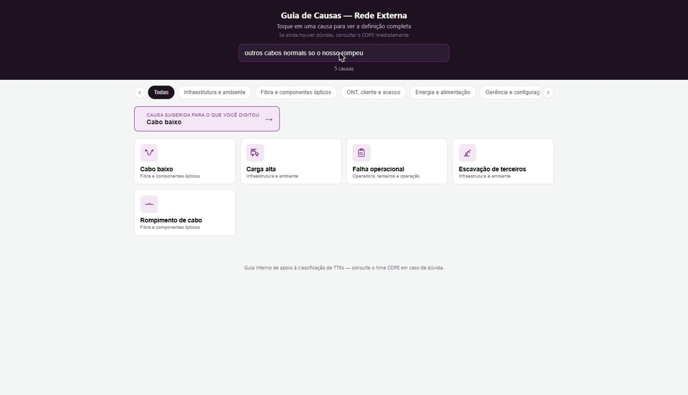

# Guia de Causas — Rede FiBrasil


[](https://brunomellodasilva.github.io/guia-causas-ttk-fibrasil/)

Catálogo pesquisável de causas de fechamento de TTK para a operação de NOC — **53 causas**, organizadas em **6 categorias**, com busca que entende descrições em linguagem natural, não só palavras-chave exatas.

**🔗 Demo ao vivo:** https://brunomellodasilva.github.io/guia-causas-ttk-fibrasil/



## Contexto

Fechar um TTK corretamente exige escolher, entre dezenas de causas possíveis, a que melhor descreve o que realmente aconteceu em campo — e cada pessoa da equipe tende a lembrar (ou digitar) a causa de um jeito diferente do nome oficial do catálogo. Isso gera fechamento inconsistente, retrabalho e dificuldade de analisar reincidência depois.

## Problema

- O catálogo oficial de causas é extenso e nem sempre intuitivo — causas parecidas (ex: "Fibra quebrada" vs. "Rompimento de cabo", ou "Cordão óptico atenuado" vs. "Fusão atenuada" vs. "CTO atenuada") têm diferenças sutis mas importantes.
- Técnico em campo geralmente sabe descrever *o que aconteceu* ("só fusão feita", "outros cabos normais, só o nosso rompeu"), mas não necessariamente o nome exato da causa no sistema.
- Uma busca por palavra-chave simples falha justamente nesses casos, porque a frase digitada raramente contém o termo técnico exato.

## Solução

Uma página única, sem backend e sem dependências, que funciona como um catálogo vivo: o usuário digita o que aconteceu com as próprias palavras (ou busca pelo termo técnico direto), filtra por categoria, e a ferramenta aponta a causa mais provável — com definição completa e alertas de uso ao abrir o card.

### 🧠 Busca interpretativa (o diferencial técnico do projeto)

Em vez de um simples `.includes()`, a busca funciona em camadas:

1. **Sinônimos de campo por causa** — cada causa carrega uma lista de frases/gírias reais que um técnico usaria ("cabo tensionado", "só fusão feita", "outros cabos normais, só o nosso rompeu").
2. **Ponderação por especificidade (IDF)** — cada palavra da base é pesada pela sua raridade no catálogo inteiro, no mesmo espírito de *TF-IDF*: palavras genéricas como "cabo" ou "rede", que aparecem em quase toda causa, pesam pouco; palavras raras e reveladoras como "caminhão", "escavadeira" ou "disjuntor" pesam muito mais. Isso evita que o termo mais comum da frase "sequestre" o resultado.
3. **Pontuação combinada** — soma o peso das palavras que batem com sinônimos (com bônus quando a maioria da frase-gíria é reconhecida) e das palavras que aparecem direto no nome/descrição, ranqueando as causas mais prováveis primeiro.
4. **Caixa de sugestão** — quando a frase digitada bate claramente com um sinônimo de campo, a causa mais provável aparece em destaque no topo, antes mesmo da lista de resultados.

Na prática: digitar *"outros cabos normais, só o nosso rompeu"* aponta direto para **Cabo baixo** — e não para **Carga alta**, que é o erro comum, mesmo as duas causas compartilhando a palavra "cabo".

## Funcionalidades

- Busca interpretativa por descrição livre (não só palavra-chave), com sugestão em destaque.
- 53 causas organizadas em 6 categorias (Infraestrutura e ambiente, Fibra e componentes ópticos, ONT/cliente/acesso, Energia e alimentação, Gerência e configuração, Operadora/terceiros/operação).
- Abas de categoria roláveis (arraste com o mouse ou use as setas), com contagem de resultados em tempo real.
- Cada causa abre um modal com definição completa e, quando aplicável, um alerta (ex: diferenciação entre causas parecidas, exigência de evidência anexada no SIGO).
- Ícones SVG desenhados sob medida para cada causa (sem biblioteca de ícones externa).
- 100% client-side: nenhuma dependência externa, nenhum dado sai do navegador.
- Responsivo, pensado para uso rápido em campo pelo celular.

## Tecnologias

- **HTML5 + CSS3 + JavaScript puro** — sem framework, sem etapa de build.
- Algoritmo de busca e ranqueamento por relevância implementado do zero (ponderação IDF, normalização de acentos, stopwords em português).
- Ícones SVG inline, desenhados especificamente para cada causa.
- **Hospedagem:** GitHub Pages (deploy estático direto do repositório).

## Estrutura do projeto

```
.
├── index.html          # aplicação completa (HTML + CSS + JS)
├── docs/
│   └── screenshot.png  # screenshot usada neste README
├── LICENSE
└── README.md
```

## Como rodar localmente

Não há instalação nem dependências: é uma página estática.

```bash
git clone https://github.com/brunomellodasilva/guia-causas-ttk-fibrasil.git
cd guia-causas-ttk-fibrasil
# abra index.html diretamente no navegador
```

Ou acesse direto pelo GitHub Pages: https://brunomellodasilva.github.io/guia-causas-ttk-fibrasil/

## Roadmap / Próximas melhorias

- [ ] Exportar o catálogo como JSON público, para reuso em outras ferramentas internas.
- [ ] Tema claro/escuro.
- [ ] Atalhos de teclado para navegação entre resultados.

## Autor

**Bruno Mello** — NOC / Infraestrutura / Automação
[GitHub](https://github.com/brunomellodasilva) · [LinkedIn](https://linkedin.com/in/brunomellodasilva)

## Licença

Distribuído sob a licença MIT. Veja [LICENSE](LICENSE) para mais detalhes.
